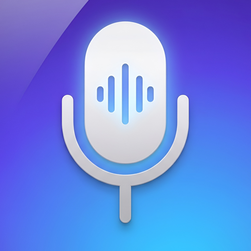

  

<h1 align="center">Grapheme</h1>

  Локальная голосовая диктовка для macOS — push-to-talk, без облака.

  
  
  

---

Grapheme распознаёт речь прямо на устройстве через [WhisperKit](https://github.com/argmaxinc/WhisperKit) на Neural Engine — без отправки аудио куда-либо. Зажал клавишу, сказал фразу, отпустил — текст вставлен туда, где стоял курсор.

## Скачать

→ **[Последний релиз](https://github.com/itpnews/grapheme-releases/releases/latest)**

Скачайте `Grapheme-vX.Y.Z.dmg`, откройте и перетащите `Grapheme.app` в `Applications`.

Сборка подписана Developer ID (`The Metaverse Apps OU`) и нотаризована Apple — Gatekeeper пропустит её без предупреждений.

## Как это работает

1. Зажмите **Right ⌥ Option** (клавиша по умолчанию) и говорите.
2. Отпустите клавишу — через долю секунды распознанный текст появится в активном поле ввода.
3. Если поле ввода недоступно (например, приложение не поддерживает программный ввод текста), текст просто окажется в буфере обмена.

Grapheme умеет распознавать русский и английский в одной фразе без переключения раскладки, автоматически расставляет пунктуацию и убирает частые слова-паразиты и англицизмы ("клеймс" → *claims*, "слэш" → `/`), возвращая их к исходному написанию.

Живая демонстрация есть прямо в онбординге при первом запуске — не нужно ничего диктовать вслепую, чтобы понять, как это работает.

## Разрешения

Приложению нужны три системных разрешения, и оно объясняет каждое из них по ходу первого запуска:

| Разрешение | Зачем |
|---|---|
| **Input Monitoring** | Распознать нажатие и отпускание клавиши-хоткея |
| **Accessibility** | Вставить распознанный текст в поле ввода активного приложения |
| **Microphone** | Записать аудио для распознавания, пока клавиша зажата |

Аудио и текст никогда не покидают устройство — распознавание работает полностью офлайн после первой загрузки модели.

## Автообновления

Grapheme проверяет обновления через [Sparkle](https://sparkle-project.org) и предлагает установить новую версию, когда она выходит. Проверить вручную можно через **Settings → Check for Updates…** в меню-баре.

Обновления публикуются в этом репозитории; исходный код и appcast подписаны отдельными ключами (код — Developer ID Apple, appcast — EdDSA), так что скомпрометировать один канал не значит подделать другой.

## Исходный код

Исходный код Grapheme закрыт и разрабатывается в отдельном приватном репозитории. Здесь публикуются только собранные, подписанные и нотаризованные бинарники и `appcast.xml` для автообновления.

## Обратная связь

Нашли баг или есть предложение — откройте [issue](https://github.com/itpnews/grapheme-releases/issues) в этом репозитории.

## Системные требования

- macOS 14.0 (Sonoma) или новее
- Apple Silicon (WhisperKit использует Neural Engine)
